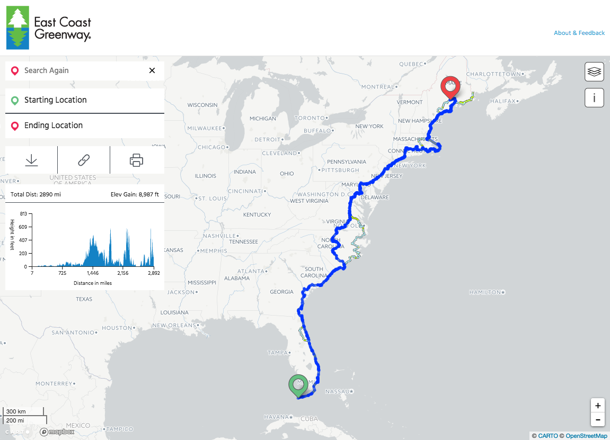

# East Coast Greenway: Map & Trip Planner


Mobile friendly, single page web application for the [East Coast Greenway](http://greenway.org) map and trip planner, developed by [GreenInfo Network](http://greeninfo.org).

Built with / runs on:

- Node.JS
- React v15.5.4
- React Router v4.x
- Redux v3.6.0
- Webpack v2.6.1
- Babel v6.x
- ESLint
- SASS
- Yarn
- Heroku

## Install Instructions
Make sure you have NodeJS >= 6.9.x and NPM >= 3.10.x and Yarn >= 0.22 installed.

### Node Version
Note the `.nvmrc` file, this makes it explicit which version of NodeJS you are using with your project. Major releases between NodeJS versions can have breaking changes, so it's good to use [Node Version Manager](https://github.com/creationix/nvm) in case you need to switch versions between projects.

If you have NVM installed, you can use the project's current version of NodeJS by doing the following in the root of this repo:

```
nvm use
```

NVM will let you know if the version of Node is currently not installed by replying with:

```
N/A: version "x.x.x -> N/A" is not yet installed.
```

and that you may install it by doing:

```
You need to run "nvm install x.x.x" to install it before using it.
```

Note that `x.x.x` is a place holder for the version of NodeJS you'd like to use, and that you'll have to do `nvm use` for each shell instance.

### Install Dependencies
To install project dependencies for both the server and client do:

```
yarn install
cd client
yarn install
```

You may also use `NPM` to install dependencies, but using Yarn is better as it resolves dependencies of dependencies ensuring will have the exact same ones if you blow away the `node_modules` directory and do an install a year from now.

It's also recommended to use Yarn to install new dependencies so that the `yarn.lock` file gets updated. You can do this by doing:

```
yarn add some-library
```

OR

```
yarn add -D some-library
```

The `-D` flag will save the dependency to `devDependencies` in `package.json`.

If you do this, make sure to commit the updated `yarn.lock` file in the `root` and/or `client` depending on where you modified dependencies.

#### Foreman
You will also need [Foreman](http://ddollar.github.io/foreman/) to run the Node.JS server locally, as Foreman is used to make environment variables specified in a `.env` file accessible to Node.JS (see the section on environment variables).

The easiest way to install Foreman is to use Ruby's `gem` command:

```
gem install foreman
```

Doing `npm run dev` in the root of the repo will have `foreman` run the Node.JS server. This is required for geo-routing API calls to work.

## Develop
To develop the app locally first do:

```
npm run dev
```

Then, in a new terminal window / tab do:

```
cd client
npm start
```

The above commands will start the Node.JS server, have Webpack compile the assets in `client`, and start [Webpack Dev Server](https://webpack.js.org/configuration/dev-server/#devserver). This should automatically open your web browser to `localhost:8888` and you should see the site once Webpack has finished its initial bundling process. Webpack will update the app's front-end codebase using [hot-module-replacement](https://webpack.js.org/concepts/hot-module-replacement/) after it finishes transpiling source code, and notify you that it has done so. For some updates you may need to refresh the page to see changes take place.

**NOTE** that there is a **proxy** enabled with the Webpack Dev Server from port 8888 to the Node.JS server which is running on port 5001. This is necessary for CORS for the app's API endpoints (see `server.js`).

### Compiling Client Codebase
To have Webpack create an optimized production build in `client/dist` do:

```bash
cd client
npm run build
```

This will create compiled and compressed JS and CSS files in the `client/dist/` directory. Note that any existing files in `client/dist/` will be blown away prior to new ones being generating using `rimraf`. These files will be served up by `server.js`, which is what happens upon deploying the app to Heroku.

**NOTE** that the `client/dist/` directory is intentionally kept of out version control in `.gitignore`. If you'd like to include the contents of `dist/` in Git, simply remove `dist/` from `.gitignore`.

### Environment Variables
Note that [Foreman](https://www.theforeman.org/) is used to run the Node.JS server in a dev environment so that ENV variables may be accessed from a `.env` file.

The `.env` file should reside in the root level of this repo and contain the following:

```
MAILCHIMP_API_KEY="<REDACTED>"
MAILCHIMP_LIST_ID="<REDACTED>"
CARTODB_USER="niles"
DBTABLE_EDGES="ecg_route_lines_prod"
NODE_ENV="development"
```

When you run `npm run dev` in the root of this repo, `Foreman` will be used to expose these variables to Node.JS for use by `server.js`.

These same environment variables are configured with Heroku for when the app is deployed.

## Deploy

### Heroku
The app is currently being deployed on Heroku. Running the following commands in the root of this repo will configure the app for being deployed on Heroku.

```bash
heroku login
heroku git:remote -a ecg-map
heroku config:set NODE_ENV=production
heroku config:set NPM_CONFIG_PRODUCTION=false
heroku config:set MAILCHIMP_API_KEY="<your mailchimp api key>"
heroku config:set MAILCHIMP_LIST_ID="<your mailchimp list id>"
heroku config:set CARTODB_USER="<your carto account name>"
heroku config:set DBTABLE_EDGES="<carto table containing route line data>"
```

To deploy the app:

```
git push heroku master
```

Or if you want to deploy a branch that _isn't_ master:

```
git push heroku branch-name:master
```

## Data
The data for this web app is being hosted on [CARTO](https://carto.com), loaded into and queried by the web app. This data is routinely edited by the ECGA staff using the [Carto QGIS plugin](https://plugins.qgis.org/plugins/QgisCartoDB/). Two lines tables exist, one writable table that ECGA staff edit using QGIS, and another production read-only table that is periodically updated with changes from the writable table. The production table is locked for editing and used by the web app.

In the [`sql`](./sql) directory there are queries for updating the data on CARTO in `ecg_lines_update_prod_table.sql` and a PostgreSQL trigger for auto-populating columns in the lines table when it is updated.

Note that some legacy SQL files & queries exist for the purpose of documenting how the original ECG data obtained from Wiki Mapping was restructured for use with this web app. Besides using these SQL queries, GreenInfo GIS staff edited the topology of the original source data to make it compatible with geographic routing.
